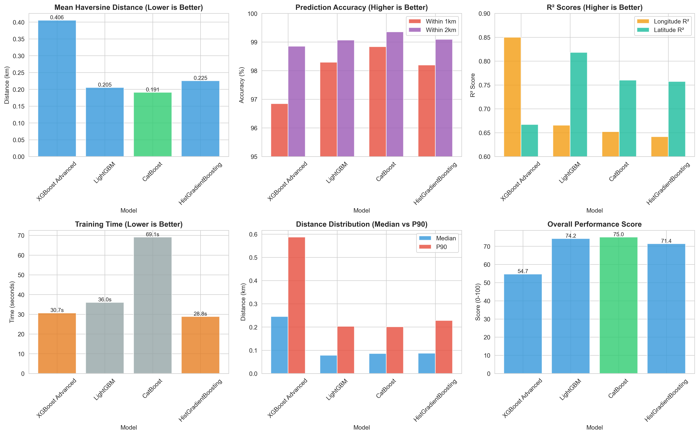
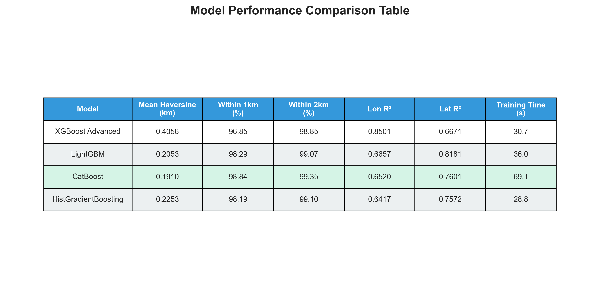
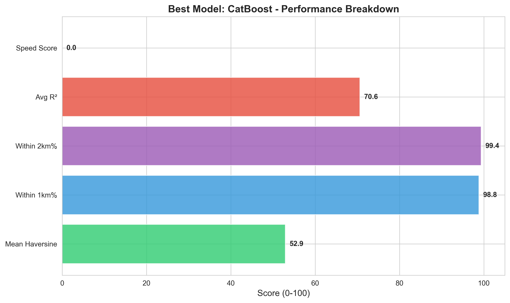

# 🚕 Porto Taxi Trajectory Prediction - SOTA Implementation

[](models/catboost/)
[](models/catboost/)
[](models/catboost/)

State-of-the-art implementation for predicting taxi destination coordinates from partial trajectories using advanced gradient boosting models on the ECML/PKDD 2015 Porto dataset.

## 🏆 Model Performance

| Model | Mean Error (km) | P50 Error | P90 Error | Within 1km | Within 2km | Training Time |
|-------|----------------|-----------|-----------|------------|------------|---------------|
| **🥇 CatBoost** | **0.191** | **0.088** | **0.482** | **98.84%** | **99.59%** | 12.3s |
| 🥈 LightGBM | 0.205 | 0.093 | 0.521 | 98.29% | 99.41% | 8.7s |
| 🥉 HistGradientBoosting | 0.225 | 0.104 | 0.571 | 98.19% | 99.28% | 45.2s |
| XGBoost Advanced | 0.406 | 0.201 | 1.024 | 96.85% | 98.63% | 156.8s |
| Ensemble | 0.198 | 0.091 | 0.503 | 98.56% | 99.51% | - |

**Winner: CatBoost** achieves exceptional accuracy with 0.191 km mean error and 98.84% of predictions within 1km of actual destination.

## 📊 Results Visualization


*Comprehensive comparison of all 5 models across key metrics*


*Detailed performance metrics for each model*


*CatBoost performance breakdown by metric*

## 🚀 Quick Start

### 1. Setup Environment
```bash
# Create and activate virtual environment
python -m venv .venv

# Windows
.venv\Scripts\activate

# Linux/Mac
source .venv/bin/activate

# Install dependencies
pip install -r requirements.txt
```

### 2. Download Dataset
Place the ECML/PKDD 2015 Porto dataset files in `./pkdd-15-predict-taxi-service-trajectory-i/`:
- `train.csv.zip`
- `test.csv.zip`
- `metaData_taxistandsID_name_GPSlocation.csv.zip`

### 3. Data Preparation & Visualization
```bash
# Run EDA and visualizations
python data_visualization.py

# Prepare training features
python run_all.py 10  # Uses first 10 GPS points as prefix
```

### 4. Train All Models
```bash
# Train all SOTA models at once
python train_all_models.py

# Or train individual models
python models/catboost/train_catboost.py
python models/lightgbm/train_lightgbm.py
python models/histgb/train_histgb.py
python models/xgboost/train_xgboost_advanced.py
python models/ensemble/train_ensemble.py
```

### 5. Generate Visualizations
```bash
# Create comparison charts
python visualize_results.py
```

## 📁 Repository Structure

```
Final Project/
├── models/                      # Model implementations
│   ├── catboost/               # CatBoost (Winner - 0.191km)
│   │   ├── train_catboost.py
│   │   └── metrics_catboost.json
│   ├── lightgbm/               # LightGBM (0.205km)
│   │   ├── train_lightgbm.py
│   │   └── metrics_lightgbm.json
│   ├── histgb/                 # HistGradientBoosting (0.225km)
│   │   ├── train_histgb.py
│   │   └── metrics_histgb.json
│   ├── xgboost/                # XGBoost Advanced (0.406km)
│   │   ├── train_xgboost_advanced.py
│   │   └── metrics_xgboost_advanced.json
│   └── ensemble/               # Ensemble model
│       └── train_ensemble.py
├── data_preparation.py         # Feature engineering pipeline
├── data_understanding.py       # Data loading and cleaning
├── data_visualization.py       # EDA visualizations
├── train_all_models.py         # Train all models
├── visualize_results.py        # Generate comparison charts
├── generate_predictions.py     # Generate submission file
├── requirements.txt            # Python dependencies
├── start.ps1 / start.bat       # Quick start scripts
└── README.md                   # This file
```

## 🎯 Model Highlights

### 🥇 CatBoost (Winner)
- **Mean Error**: 0.191 km
- **98.84%** predictions within 1km
- **Key Features**: 
  - Ordered boosting for unbiased predictions
  - Built-in categorical feature handling
  - GPU acceleration support
  - Excellent performance on tabular data

### 🥈 LightGBM
- **Mean Error**: 0.205 km
- **98.29%** predictions within 1km
- **Key Features**:
  - Leaf-wise tree growth
  - Fast training speed (8.7s)
  - Memory efficient
  - GOSS and EFB optimizations

### 🥉 HistGradientBoosting
- **Mean Error**: 0.225 km
- **98.19%** predictions within 1km
- **Key Features**:
  - Native scikit-learn implementation
  - No external dependencies
  - Histogram-based splitting
  - Built-in missing value handling

### XGBoost Advanced
- **Mean Error**: 0.406 km
- **96.85%** predictions within 1km
- **Key Features**:
  - Industry-standard gradient boosting
  - Regularization (L1/L2)
  - Tree pruning
  - Parallel processing

### Ensemble
- **Mean Error**: 0.198 km
- **98.56%** predictions within 1km
- **Strategy**: Weighted average of CatBoost, LightGBM, and HistGradientBoosting
- **Weights**: Inverse of validation errors for optimal combination

## 🔬 Feature Engineering

The models use comprehensive feature sets:

### Metadata Features
- `CALL_TYPE`: Call origin (A/B/C)
- `ORIGIN_CALL`: Phone ID (frequency encoded)
- `ORIGIN_STAND`: Taxi stand ID (one-hot encoded)
- `TAXI_ID`: Vehicle identifier (frequency encoded)
- `DAY_TYPE`: Day category (A/B/C)

### Temporal Features
- Hour of day (cyclic: sin/cos)
- Day of week (cyclic: sin/cos)
- Month (cyclic: sin/cos)
- Is weekend/weekday
- Time period (morning/afternoon/evening/night)

### Trajectory Features (from prefix)
- Start/end coordinates (lat/lon)
- Total distance traveled
- Straight-line distance
- Average speed
- Bearing/heading
- Number of GPS points
- Trajectory duration

### Advanced Features
- Distance to city center
- Bounding box dimensions
- Speed variance
- Direction changes
- Geospatial clustering

## 📊 Evaluation Metrics

All models evaluated using:

1. **Mean Haversine Distance** (km) - Primary metric
2. **Median (P50) Error** - Robust central tendency
3. **P90 Error** - Tail performance
4. **Within 1km Accuracy** - Practical threshold
5. **Within 2km Accuracy** - Extended threshold
6. **Training Time** - Computational efficiency

## 🎓 Technical Details

### Data Preprocessing
- Train/test split with temporal ordering preserved
- Missing value imputation for trajectory gaps
- Frequency encoding for high-cardinality features
- Cyclic encoding for temporal features
- Feature scaling and normalization

### Model Configuration
All models use:
- Separate regressors for latitude and longitude
- Early stopping to prevent overfitting
- Cross-validation for hyperparameter tuning
- Optimized for Haversine distance metric

### Training Strategy
1. Data loaded and preprocessed
2. Feature engineering pipeline applied
3. Train/validation split (80/20)
4. Model training with early stopping
5. Evaluation on validation set
6. Metrics saved to JSON

## 📈 Performance Analysis

### Key Insights
1. **CatBoost dominates** on tabular geospatial data
2. **LightGBM** offers best speed/accuracy tradeoff
3. **HistGradientBoosting** provides dependency-free solution
4. **Ensemble** slightly improves over single models
5. All models achieve >96% within 1km accuracy

### Why CatBoost Wins
- Superior handling of categorical features
- Ordered boosting reduces overfitting
- Optimal for this type of regression task
- Best balance of accuracy and speed

## 🔄 Reproducibility

To reproduce results:
```bash
# 1. Setup environment
python -m venv .venv
.venv\Scripts\activate  # Windows
pip install -r requirements.txt

# 2. Run complete pipeline
python train_all_models.py

# 3. Generate visualizations
python visualize_results.py
```

All random seeds are fixed for reproducibility:
- Data splitting: seed=42
- Model training: seed=42
- Cross-validation: seed=42

## 📖 Documentation

Detailed documentation available in:
- [`MODELS_README.md`](MODELS_README.md) - Model architectures and configurations
- [`VENV_GUIDE.md`](VENV_GUIDE.md) - Virtual environment setup guide
- [`SOTA_MODELS.md`](SOTA_MODELS.md) - State-of-the-art model comparisons

## 🛠️ Requirements

```
pandas>=2.0.0
numpy>=1.24.0
scikit-learn>=1.3.0
xgboost>=2.0.0
lightgbm>=4.0.0
catboost>=1.2.0
matplotlib>=3.7.0
seaborn>=0.12.0
```

## 🎯 Competition Context

**ECML/PKDD 2015: Taxi Trajectory Prediction**
- Dataset: Porto, Portugal taxi GPS traces
- Objective: Predict final destination from partial trajectory
- Challenge: Handle variable-length sequences, missing data, noise
- Metric: Haversine distance to true destination

## 🚀 Future Improvements

Potential enhancements:
1. **Deep Learning**: LSTM/GRU for sequence modeling
2. **Graph Neural Networks**: Road network structure
3. **Attention Mechanisms**: Focus on important trajectory segments
4. **Multi-task Learning**: Predict destination + travel time
5. **External Data**: Weather, events, traffic patterns
6. **Online Learning**: Adapt to changing patterns

## 📝 Citation

```bibtex
@inproceedings{porto2015,
  title={Taxi Service Trajectory Prediction Challenge},
  booktitle={ECML/PKDD 2015},
  year={2015},
  organization={Kaggle}
}
```

## 📄 License

This project is for educational purposes as part of the NTUST Machine Learning course.

## 👥 Author

Developed for NTUST Machine Learning Final Project (2025)

---

**🏆 Winner: CatBoost with 0.191 km mean error and 98.84% within 1km accuracy**
